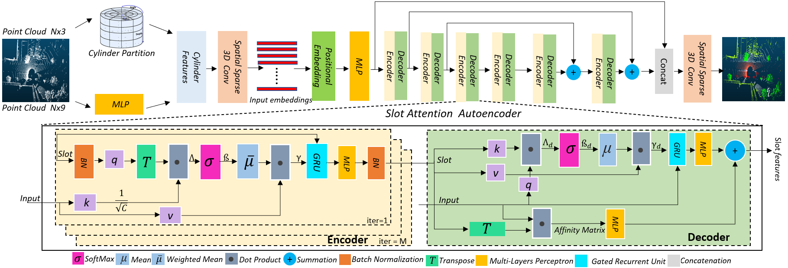

# SAT3D

This repository is an official implementation of the [SAT3D: Slot Attention Transformer for 3D Point Cloud Semantic Segmentation](https://arxiv.org/), IEEE Transactions on Intelligent Transportation Systems  
By Muhammad Ibrahim, Naveed Akhtar, [Saeed Anwar](https://saeed-anwar.github.io/), and [Ajmal Mian](https://ajmalsaeed.net/)


## Coming soon
- [ ] Segmentation Code
- [ ] Segmentation Model
- [ ] Swan Dataset
- [ ] Results


## Introduction

**SAT3D**, Semantic segmentation of the 3D point cloud is a key task in numerous intelligent transportation system applications, e.g., self-driving vehicles, traffic monitoring. Due to the sparsity and varying density of  points in the outdoor point clouds, it becomes  particularly challenging to extract object-centric features from data. This leads to poor semantic segmentation, especially for the rare object classes. To address that, we introduce the first-ever Slot Attention Transformer based technique to effectively model object-centric features in point cloud data. Our method uses cylindrical splits of space for voxelization and computes channel-wise positional embeddings before repetitively encoding the point cloud with slot attentions. Our second major contribution is a Large-Scale Outdoor Point Cloud dataset (SWAN), collected in a dense urban environment, driving 150km distance. It provides 16 billion points in more than 200K frames. The dataset also provides annotations for 10K frames for 24 classes. We also contribute a data augmentation scheme to handle rare object classes in real-world point clouds. Besides benchmarking popular existing methods on SWAN for the first time, we thoroughly evaluate our technique on the existing large-scale datasets, Semantic KITTI and nuScenes. Our results demonstrate a consistent performance gain for our technique and verify the need of the more challenging SWAN dataset. 

<div align=center>

</div>

## Dataset Comparisons
  
**Comparison of the SWAN (proposed) with Semantic KITTI and nuScenes dataset**

| Properties              | Ours          | Semantic KITTI | nuScenes    | 
| :---:                   | :---:         | :---:          | :---:       |  
| Classes                 | 24            | 19             | 16          |
| Max points per frame    | 131K          | 131K           | 65K         |
| Data Collection vehicle | car, trolley  | car            | car         | 
| Point-wise labels       | Yes           | Yes            | Yes         |
| Instance labels         | Yes           | No             | No          | 
| Labeled frames          | 10K           | 23K            | 35K         | 
| Location                | Perth,WA      | Karlsruhe      | Boston, SG  |
| Sensor                  | Ouster-64     | Velodyne-64E   | LiDAR-32    | 
| Vertical resolution     | 64            | 64             | 32          | 
| Sensor Vertical FoV     | 45            | 26.9           | 40          | 


## Citation

If this work is helpful for your research, please consider citing the following BibTeX entry.

```
@article{Ibrahim2023SAT3D,
  title={SAT3D: Slot Attention Transformer for 3D Point Cloud Semantic Segmentation},
  author={Ibrahim, Muhammad and Akhtar, Naveed and Anwar, Saeed and Mian, Ajmal},
  journal={IEEE Transactions on Intelligent Transportation Systems (T-ITS)},
  year={2023}
}

@article{Ibrahim2023slice,
  title={Slice Transformer and Self-supervised Learning for 6DoF Localization in 3D Point Cloud Maps},
  author={Ibrahim, Muhammad and Akhtar, Naveed and Anwar, Saeed and Wise, Michael and Mian, Ajmal},
  journal={IEEE International Conference on Robotics and Automation (ICRA)},
  year={2023}
}
```
